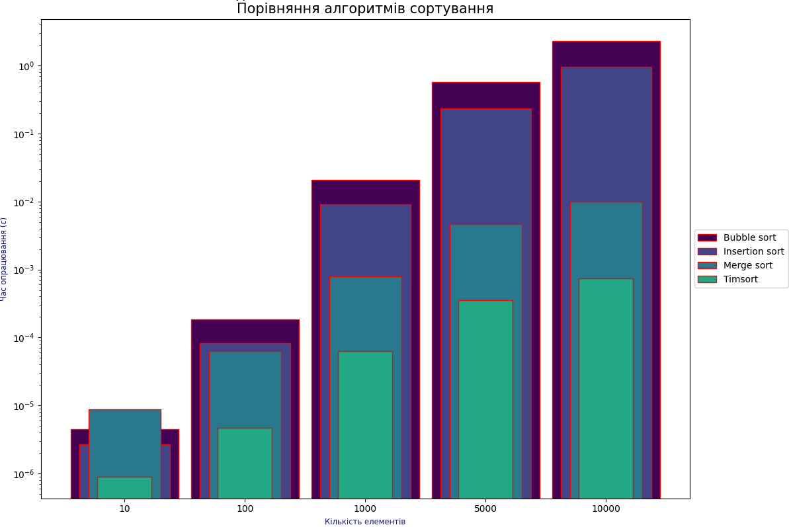

# Sorting HomeWork Module 4 Neoversity

<h3>Опис домашнього завдання</h3>

Python має дві вбудовані функції сортування: <i>sorted</i> і <i>sort</i>. Функції сортування Python використовують Timsort — гібридний алгоритм сортування, що поєднує в собі сортування злиттям і сортування вставками.

Порівняйте три алгоритми сортування: злиттям, вставками та Timsort за часом виконання. Аналіз повинен бути підтверджений емпіричними даними, отриманими шляхом тестування алгоритмів на різних наборах даних. Емпірично перевірте теоретичні оцінки складності алгоритмів, наприклад, сортуванням на великих масивах. Для заміру часу виконання алгоритмів використовуйте модуль <b><i>timeit</b></i>.

Порівняйте три алгоритми сортування: злиттям, вставками та Timsort за часом виконання. Аналіз повинен бути підтверджений емпіричними даними, отриманими шляхом тестування алгоритмів на різних наборах даних. Емпірично перевірте теоретичні оцінки складності алгоритмів, наприклад, сортуванням на великих масивах. Для заміру часу виконання алгоритмів використовуйте модуль timeit.

<h3>Необов'язкове завдання</h3>

Дано <b>k</b> відсортованих списків цілих чисел. Ваше завдання — об'єднати їх у один відсортований список. При виконанні завдання можете опиратися на алгоритм сортування злиттям з конспекту. Реалізуйте функцію <b><i>merge_k_lists</b></i>, яка приймає на вхід список відсортованих списків та повертає відсортований список.

<h3>Висновок</h3>

Як вбачається з експерименту:

<ul>
    <li>
Timsort є найкращим алгоритмом сортування, що показує відмінні результати на всіх розмірах сортувальних даних. Він на порядок швидший за сортування злиттям та на 2 порядки за сортування бульбашкою та вставками (по останніх двох результат покращується із збільшенням кількості сортувальних даних);
</li>
    <li>
- В свою чергу, сортування злиттям на порядок швидше за сортування бульбашкою та вставками, але при кількості даних більшій за 1000. Інакше, при розмірі даних до 100 він майже однаковий із сортуванням вставками. А на досить маленьких наборах даних (менше 20) навіть програє сортуванню бульбашками та вставками;
</li>
    <li>
- Сортування вставками дещо випереджає сортування бульбашкою на всіх розмірах даних, яке є найменш швидким з усіх алгоритмів.
</li>
</ul>